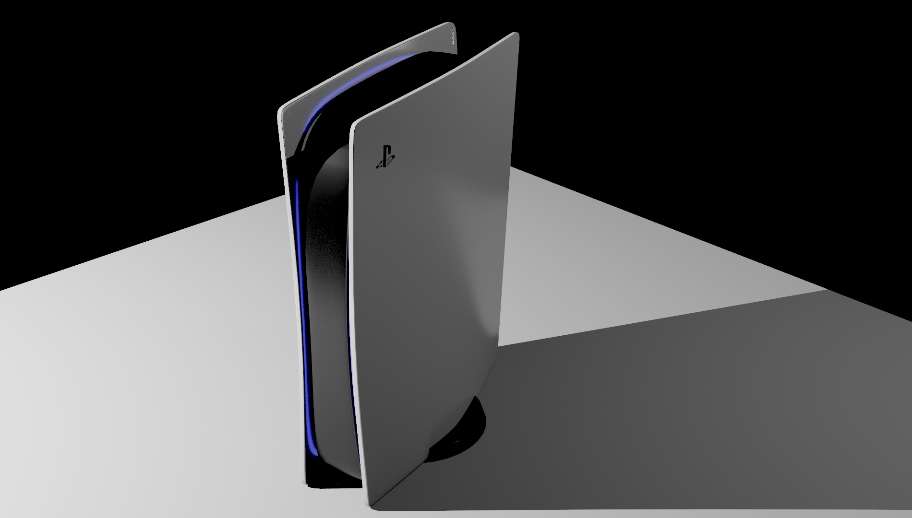

<h1 align="center">
    Path Tracer
</h1>
<p align="center">
   <a href="https://github.com/flomonster/path-tracer/actions">
      
   </a>
</p>
<hr>

This project is an implementation of Monte Carlo path tracing in **Rust**.


## Examples:



## How to use ?

The renderer takes a custom Internal Scene Format (isf) as input.

But don't worry we're able to convert **glTF** scenes into **isf**.

Minimal command line:

```sh
path-tracer convert --help # Prompt all available options for scene conversion
path-tracer render --help # Prompt all available options for rendering
path-tracer convert my_scene.glb my_scene_isf/ # Convert a gltf scene into an isf
path-tracer render scene.isf -o my-render.png -p profile.yml # Render a scene with a custom profile
```

## Profile

Profile files are used to configure the renderer behaviour. 

| Option | Description | Default |
|------------|----------------|-------------------|
| `resolution.width` | Width of the output image | `1920` |
| `resolution.height` | Height of the output image | `1080` |
| `samples` | Number of sample ray throw by pixel | `64` |
| `bounces` | Maximum number of bounces per sample | `4` |
| `brdf` | Which brdf tu use (`COOK_TORRANCE`) | `COOK_TORRANCE` |
| `tonemap` | Which color tone map tu use (`REINHARD`, `FILMIC`, `ACES`) | `FILMIC` |
| `nb_threads` | Number of threads to use (`0` will use the maximum available threads) | `0` |

Here is a profile example.

```yaml
resolution: # Resolution of the output image
  width: 1920
  height: 1080
samples: 64 # Number of sample ray throw by pixel
bounces: 4 # Maximum number of bounces per sample
brdf: COOK_TORRANCE # Which brdf to use
tonemap: FILMIC # Which color tone map to use
nb_threads: 8 # Number of threads to use (0 will use the maximum available threads)
```

## Features

- [x] Parallel computation
- [x] KD Tree
- [x] Unidirectional Monte Carlo path tracing
- [x] Microfacet BRDF
- [x] Importance sampling
- [x] Various Tone mapping
- [x] Viewer
- [x] Alpha Transparency
- [ ] Snell Refraction
- [ ] BSSRDF
- [ ] ...
